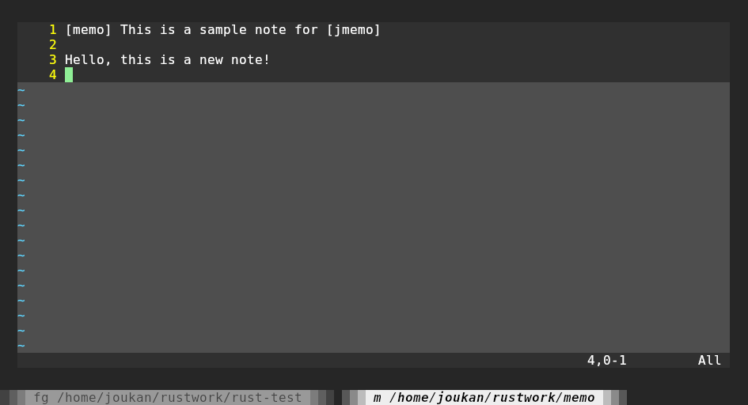
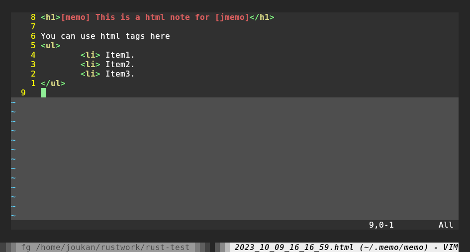
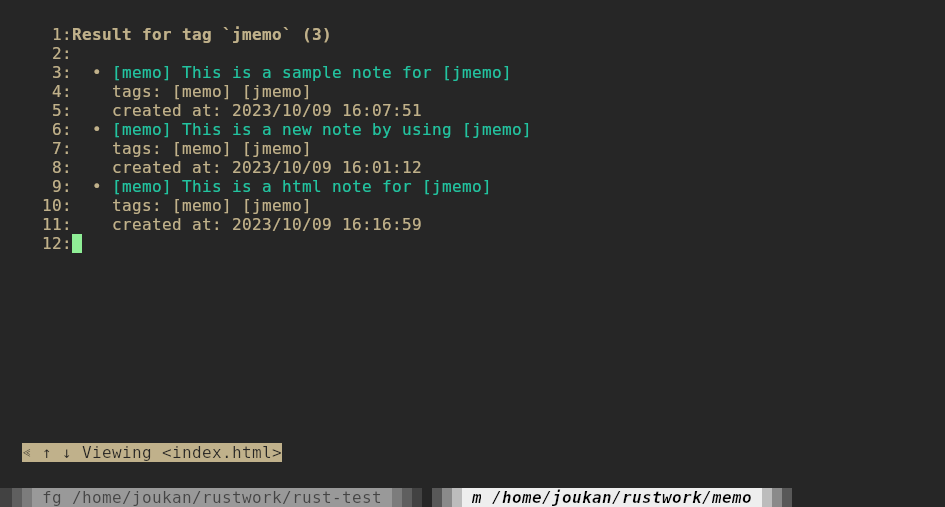
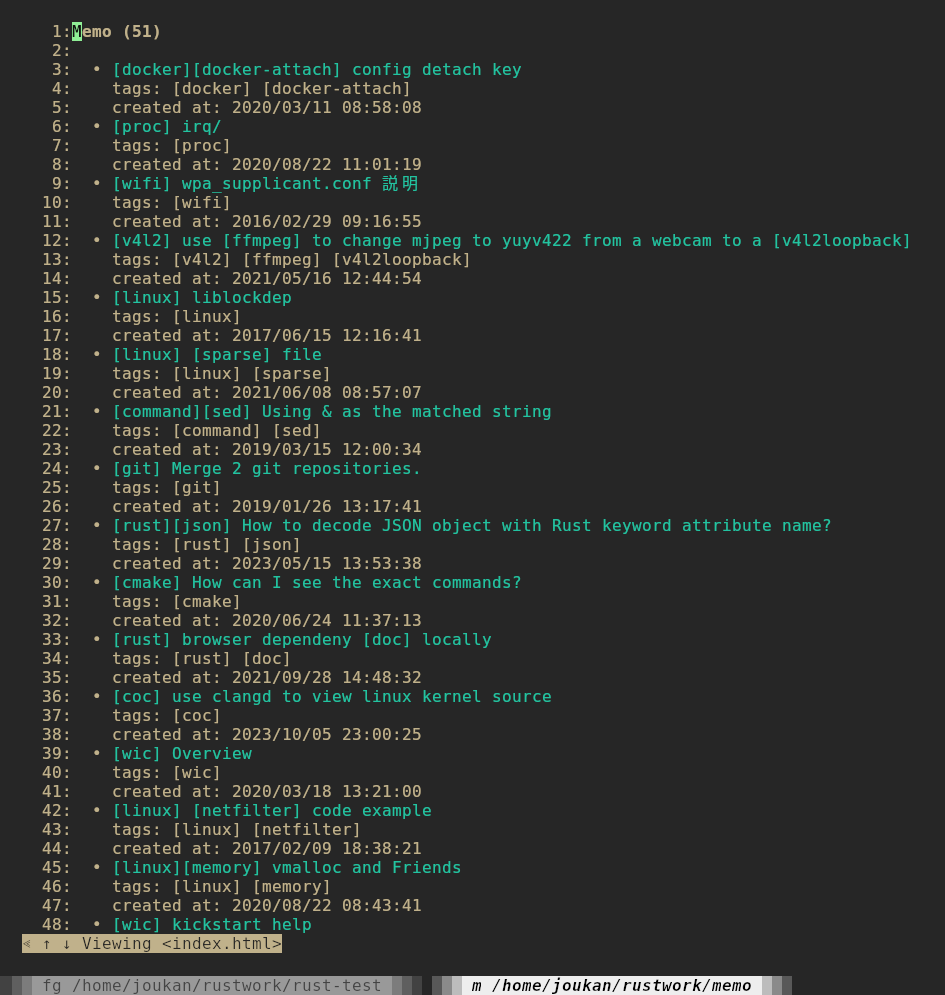
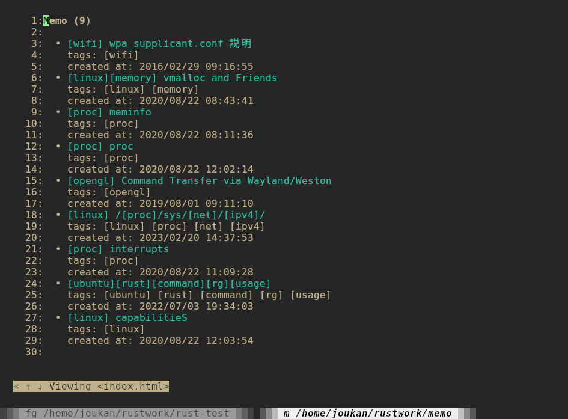

# jmemo

jmemo (memo) is a simple CUI tool for creating and managing notes.

* Plain text and html notes.
* Tag support for notes classification.
* Smart note search.
  * Search note by using tags.
  * Search multiple keywords with logical operators like "or (+)", "not (-)", "and (*)".
  * Ignore case-sensitive
  etc

## Dependency

At present, jmemo uses _w3m_ to display notes and _vim_ to create/edit note.

## Usage

### Create New Note

```
$ memo -a 
```


jmemo starts vim to create a new note. The first line is the title of the note and will be displayed in the note view. A tag is a word in the title and wrapped by "[]", like [jmemo]. You can create multiple tags in a title.

A html note can be created by specifying "-A" instead of "-a", you can use html tags like in the note.
```
$ memo -A
```



__Note__

* If you remove all the content and quit, the note will not be saved. You can also use this way to remove a note.
* Created notes are saved in ${HOME}/.memo/memo/ as plain text/html file.

### Search and Display Note

#### Search By Tag
Use "-t _TAG_" to specify a tag to search all notes tagged by it. The searching results are displayed by using _w3m_. You can use _w3m_ to browser them.

```
$ memo -t <jmemo> [-WI]
```


__Note__

* By default, tag can be parted matched. For example you can specify "j" to match all tags include "j". If you want to match a complete tag name, add "-W" option.
* By default, tag is searched case-sensitvely, You can specify "-I" to ignore cases.


#### Search By Keyword
A full-text search can be done by specifying keywords without options. Following example search all notes including a "example" in it.
```
$ memo example
```


You can filter the searching result by using logical operators. For example following command uses "And (*)" operator to search the result including both "example" and "memo" keywords. 

```
$ memo 'example * memo'
```



__Note__

* Please use single quotation marks('') to make sure the logical operators not be translated by shell. 
* Following logical operators are supported:
  * And (*)  
    'example * memo' means including both "example" and "memo" keywords.
  * Or (+)
    'example + memo' means including "example" or "memo" keyword.
  * Not (-)
    'example + memo' means including "example" but __NOT__ including "memo" keyword.
* Multiple logitical operators can be used. All operators are applied from left  to right without priority.
* By default, keywords are parted matched. If you want to match a complete keyword, add "-W" option.
* By default, keywords are searched case-sensitvely, You can specify "-I" to ignore cases.
* You can combine the usage of tag and keyword search, in that case, search result is limited to notes with specified tag.
