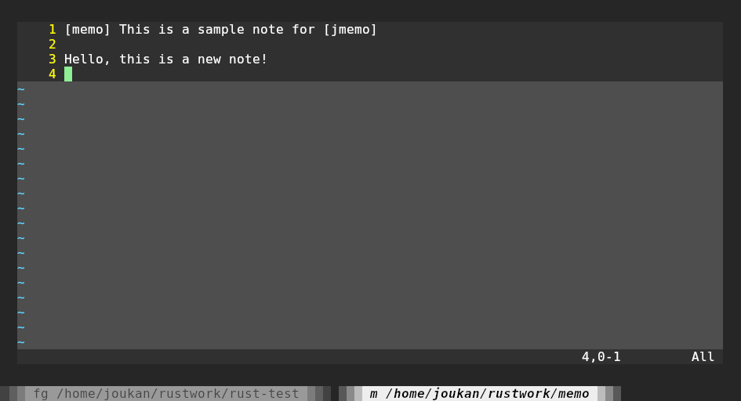
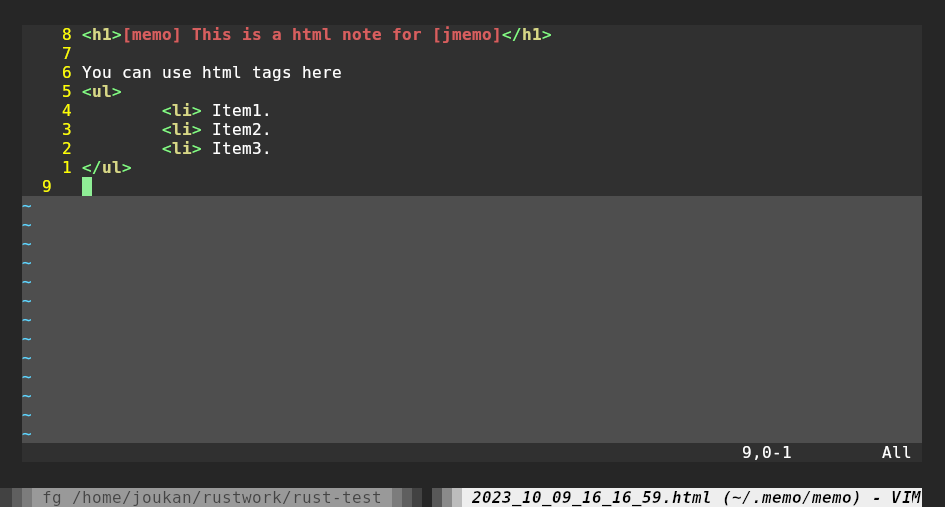
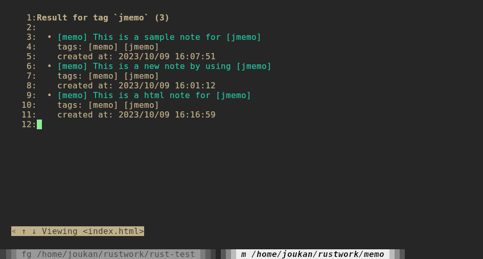
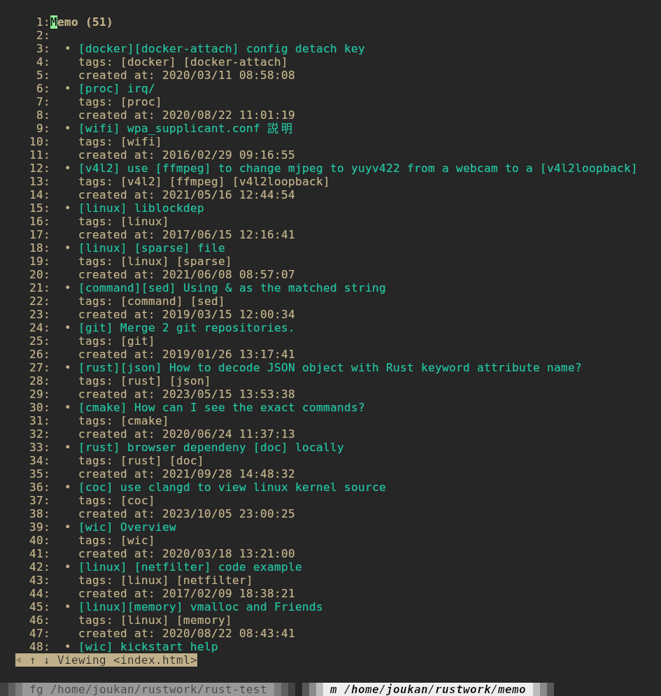
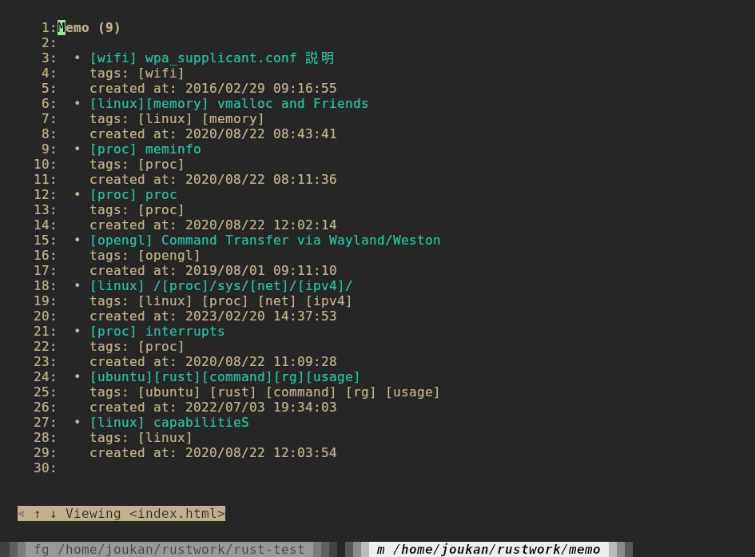
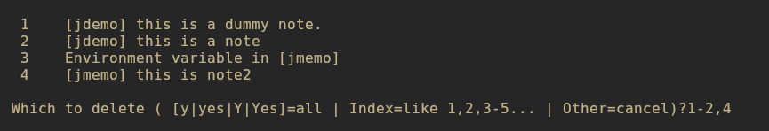

# jmemo

jmemo (memo) is a simple CUI tool for creating and managing notes.

* Plain text and html notes.
* Tag support for notes classification.
* Smart note search.
  * Search note by using tags.
  * Search multiple keywords with logical operators like "or (+)", "not (-)", "and (*)".
  * Ignore case-sensitive
  etc

## Dependency

At present, jmemo uses _w3m_ to display notes and _vim_ to create/edit note.

## Usage

### Create New Note

```
$ memo -a 
```


jmemo starts vim to create a new note. The first line is the title of the note and will be displayed in the note view. A tag is a word in the title and wrapped by "[]", like [jmemo]. You can create multiple tags in a title.

The note format is selected with "-f". The default is "text"; "html" and "markdown" are also supported. For example, a html note (in which you can use html tags) is created with:
```
$ memo -a -f html
```



A markdown note is created with:
```
$ memo -a -f markdown
```
Markdown notes are rendered to HTML when displayed, so they show up formatted in the browser.

__Note__

* If you remove all the content and quit, the note will not be saved. You can also use this way to remove a note.
* Created notes are saved in ${HOME}/.memo/memo/ as plain text/html/markdown file.
* jmemo cleans up empty notes (a file with a valid jmemo name but no content) the next time it loads them. Any other files placed in ${HOME}/.memo/memo/ that are not jmemo notes are simply ignored and left untouched.

### Search and Display Note

#### Search By Tag
Use "-t _TAG_" to specify a tag to search all notes tagged by it. The searching results are displayed by using _w3m_. You can use _w3m_ to browser them.

```
$ memo -t <jmemo> [-WI]
```


__Note__

* By default, tag can be parted matched. For example you can specify "j" to match all tags include "j". If you want to match a complete tag name, add "-W" option.
* By default, tag is searched case-sensitively, You can specify "-I" to ignore cases.


#### Search By Keyword
A full-text search can be done by specifying keywords without options. Following example search all notes including a "example" in it.
```
$ memo example
```


You can filter the searching result by using logical operators. For example following command uses "And (*)" operator to search the result including both "example" and "memo" keywords. 

```
$ memo 'example * memo'
```



__Note__

* Please use single quotation marks('') to make sure the logical operators not be translated by shell. 
* Following logical operators are supported:
  * And (*)  
    'example * memo' means including both "example" and "memo" keywords.
  * Or (+)
    'example + memo' means including "example" or "memo" keyword.
  * Not (-)
    'example + memo' means including "example" but __NOT__ including "memo" keyword.
* Multiple logical operators can be used. All operators are applied from left  to right without priority.
* By default, keywords are parted matched. If you want to match a complete keyword, add "-W" option.
* By default, keywords are searched case-sensitively, You can specify "-I" to ignore cases.
* You can combine the usage of tag and keyword search, in that case, search result is limited to notes with specified tag.
* If neither tag or keyword is specified, all notes will be displayed.

#### Delete Notes
You can use a "-d" option together with search to select notes to delete.

```
$ memo 'jdemo + jmemo * note' -d
```


The example above will delete No1, No2 and No4 notes. If you input "y", "yes", "Y"  or "Yes", all notes listed will be deleted. Other keys will ignore delete operation.

#### Edit Notes
You can use a "-e" option together with search to select notes to edit.

```
$ memo 'jdemo + jmemo * note' -e
```

The search result is listed and numbered just like the delete case. Select the notes to edit by inputting "y", "yes", "Y" or "Yes" (all notes listed) or an index like "1,2,3-5". Other keys will cancel the edit operation. Each selected note is opened in the editor (set by the `EDITOR` environment variable, default `vim`) one by one; close the editor to move on to the next note.

__Note__

* If you remove all the content of a note while editing and quit, the note will be cleaned up the next time jmemo loads it (the same empty-note behavior as when creating a note). So "-e" can also be used to delete a note by clearing it.